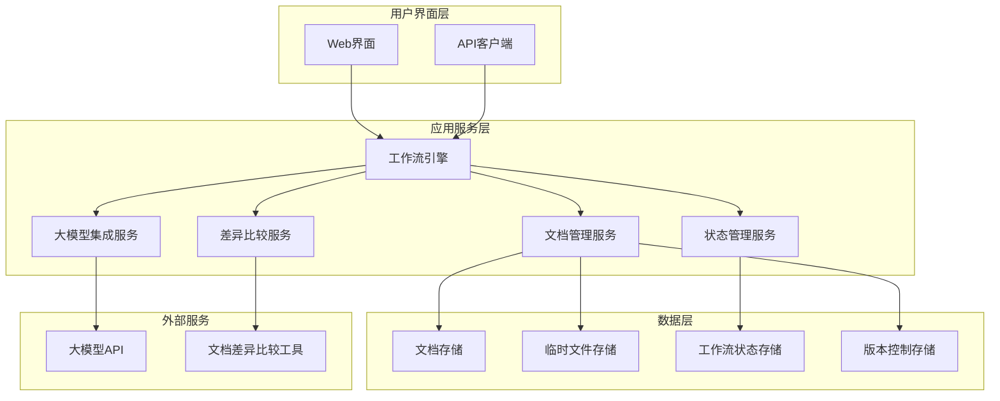
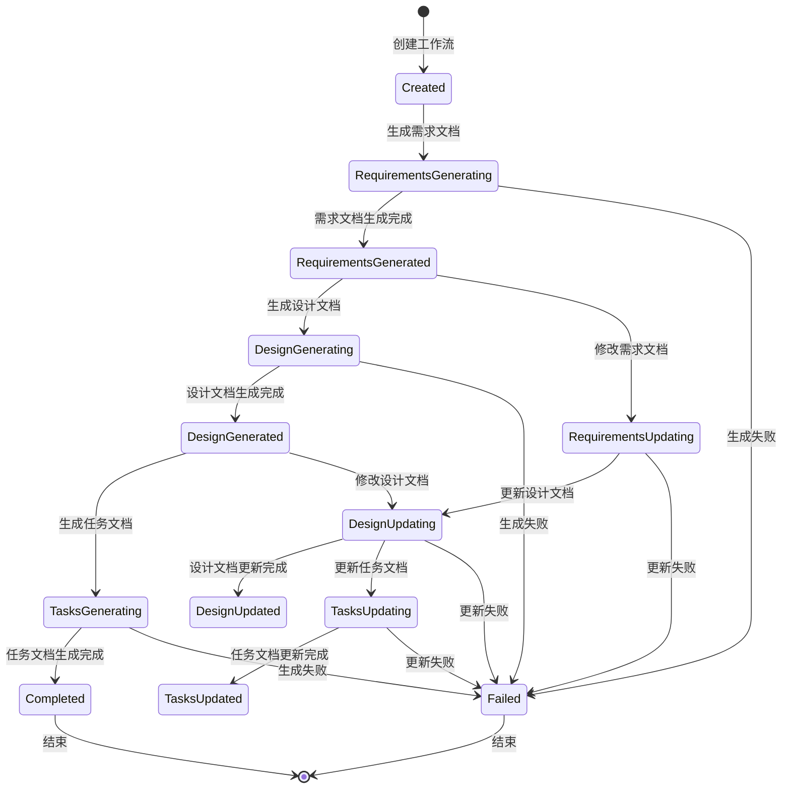

# 工作流系统架构设计文档

## 1. 架构概述

### 1.1 架构目标
- **可扩展性**: 支持多种工作流类型和文档处理流程，便于后续功能扩展
- **高可用性**: 确保工作流执行的稳定性和数据安全性
- **可维护性**: 模块化设计，便于维护和升级
- **智能化**: 集成大模型能力，实现文档的智能生成和更新

### 1.2 架构原则
- **单一职责原则**: 每个组件专注于特定功能
- **开闭原则**: 对扩展开放，对修改关闭
- **依赖倒置原则**: 高层模块不依赖低层模块，依赖抽象而非具体实现
- **接口隔离原则**: 使用最小化接口，避免接口污染
- **状态机模式**: 工作流状态转换采用状态机管理

## 2. 系统架构

### 2.1 整体架构图



### 2.2 架构分层

#### 2.2.1 表示层
- **Web界面**: 基于React的用户界面，提供工作流操作和文档管理功能
- **API客户端**: 提供RESTful API接口，支持外部系统集成

#### 2.2.2 业务层
- **工作流引擎**: 核心业务逻辑，负责工作流的执行和状态管理
- **文档管理服务**: 处理文档的生成、保存、修改等操作
- **差异比较服务**: 实现文档版本间的差异比较
- **大模型集成服务**: 与大模型API交互，实现文档的智能生成和更新
- **状态管理服务**: 管理工作流状态和文档状态

#### 2.2.3 数据层
- **文档存储**: 存储需求文档、设计文档、任务文档等正式文档
- **临时文件存储**: 存储临时保存的文档版本
- **工作流状态存储**: 存储工作流执行状态和历史记录
- **版本控制存储**: 存储文档版本信息和变更历史

## 3. 服务设计

### 3.1 服务拆分

| 服务名称 | 职责 | 技术栈 | 数据存储 |
|----------|------|--------|----------|
| 工作流引擎 | 工作流执行、状态管理、流程控制 | Node.js + TypeScript | 内存 + 持久化存储 |
| 文档管理服务 | 文档CRUD、版本管理、临时保存 | Node.js + TypeScript | 文件系统 + 数据库 |
| 差异比较服务 | 文档差异计算、比较结果格式化 | Node.js + TypeScript | 内存缓存 |
| 大模型集成服务 | 大模型API调用、提示词管理 | Node.js + TypeScript | 缓存 + 日志 |
| 状态管理服务 | 状态持久化、事件发布订阅 | Node.js + TypeScript | 数据库 |

### 3.2 服务间通信

#### 3.2.1 同步通信
- **协议**: RESTful API + gRPC
- **负载均衡**: 内部服务直连，无需负载均衡
- **超时控制**: 30秒超时，支持重试机制

#### 3.2.2 异步通信
- **消息队列**: 使用事件发布订阅模式
- **事件驱动架构**: 工作流状态变更触发相应事件
- **事件类型**: 文档生成、文档修改、状态转换等

### 3.3 API设计

#### 3.3.1 工作流管理API
- **URL**: `/api/v1/workflow`
- **Method**: `POST`
- **描述**: 创建新的工作流实例
- **请求参数**:
  ```json
  {
    "type": "basic_workflow",
    "input": {
      "requirements": "需求内容",
      "userId": "用户ID"
    }
  }
  ```
- **响应格式**:
  ```json
  {
    "code": 200,
    "data": {
      "workflowId": "wf_123456",
      "status": "created",
      "steps": [
        {
          "name": "需求文档生成",
          "status": "pending"
        }
      ]
    },
    "message": "工作流创建成功"
  }
  ```

#### 3.3.2 文档管理API
- **URL**: `/api/v1/documents`
- **Method**: `POST`
- **描述**: 生成或更新文档
- **请求参数**:
  ```json
  {
    "workflowId": "wf_123456",
    "documentType": "requirements",
    "content": "文档内容",
    "isTemporary": true
  }
  ```
- **响应格式**:
  ```json
  {
    "code": 200,
    "data": {
      "documentId": "doc_123456",
      "version": "1.0",
      "status": "saved"
    },
    "message": "文档保存成功"
  }
  ```

#### 3.3.3 文档差异比较API
- **URL**: `/api/v1/documents/diff`
- **Method**: `POST`
- **描述**: 比较两个文档版本的差异
- **请求参数**:
  ```json
  {
    "documentId": "doc_123456",
    "sourceVersion": "1.0",
    "targetVersion": "2.0"
  }
  ```
- **响应格式**:
  ```json
  {
    "code": 200,
    "data": {
      "diffs": [
        {
          "type": "added",
          "content": "新增内容",
          "line": 10
        }
      ],
      "summary": "差异摘要"
    },
    "message": "差异比较完成"
  }
  ```

## 4. 数据架构

### 4.1 数据存储策略

#### 4.1.1 文档存储
- **关系型数据库**: 存储文档元数据、版本信息、工作流状态
- **文件系统**: 存储文档正文内容，支持大文件存储
- **缓存层**: 缓存常用文档和临时文件，提高访问性能

#### 4.1.2 临时文件存储
- **内存缓存**: 短期临时文件，快速访问
- **磁盘存储**: 长期临时文件，持久化保存
- **自动清理**: 定期清理过期临时文件

#### 4.1.3 版本控制存储
- **增量存储**: 只存储版本间的差异，节省空间
- **快照机制**: 定期创建完整快照，确保数据安全
- **回滚支持**: 支持回滚到任意历史版本

### 4.2 数据模型

#### 4.2.1 工作流实例
```typescript
interface WorkflowInstance {
  id: string;
  type: 'basic_workflow' | 'requirements_update' | 'design_update';
  status: 'created' | 'running' | 'completed' | 'failed';
  input: WorkflowInput;
  steps: WorkflowStep[];
  createdAt: Date;
  updatedAt: Date;
  userId: string;
}
```

#### 4.2.2 文档实体
```typescript
interface Document {
  id: string;
  workflowId: string;
  type: 'requirements' | 'design' | 'tasks';
  content: string;
  version: string;
  isTemporary: boolean;
  createdAt: Date;
  updatedAt: Date;
  authorId: string;
}
```

#### 4.2.3 文档版本
```typescript
interface DocumentVersion {
  id: string;
  documentId: string;
  version: string;
  content: string;
  changelog: string;
  createdAt: Date;
  authorId: string;
}
```

### 4.3 数据一致性

#### 4.3.1 强一致性场景
- 工作流状态变更：确保状态转换的原子性
- 文档版本控制：确保版本号的唯一性和递增性
- 用户权限验证：确保操作权限的实时性

#### 4.3.2 最终一致性场景
- 文档生成异步处理：允许短暂延迟，最终保证一致性
- 大模型API调用：网络延迟导致的数据不一致，通过重试机制保证
- 临时文件清理：异步清理，不影响主要业务流程

## 5. 工作流引擎设计

### 5.1 状态机设计



### 5.2 工作流步骤定义

#### 5.2.1 基础工作流步骤
1. **需求输入**: 接收用户需求内容
2. **需求文档生成**: 调用大模型生成需求文档
3. **需求文档临时保存**: 保存需求文档到临时存储
4. **设计文档生成**: 基于需求文档生成设计文档
5. **设计文档临时保存**: 保存设计文档到临时存储
6. **任务文档生成**: 基于设计文档生成任务文档

#### 5.2.2 需求文档修改流程
1. **需求文档修改**: 用户修改需求文档
2. **差异比较**: 比较修改版本与临时保存版本
3. **设计文档更新**: 基于差异更新设计文档
4. **设计文档临时保存**: 保存更新后的设计文档

#### 5.2.3 设计文档修改流程
1. **设计文档修改**: 用户修改设计文档
2. **差异比较**: 比较修改版本与临时保存版本
3. **任务文档更新**: 基于差异更新任务文档
4. **任务文档临时保存**: 保存更新后的任务文档

## 6. 文档差异比较机制

### 6.1 差异比较算法

#### 6.1.1 文本差异算法
- **算法选择**: 使用Myers算法进行行级差异比较
- **性能优化**: 大文件采用分块比较策略
- **结果格式**: 统一差异格式，支持大模型理解

#### 6.1.2 结构化差异算法
- **文档解析**: 解析Markdown结构，识别标题、段落、列表等
- **语义比较**: 基于文档结构进行语义级差异比较
- **变更追踪**: 追踪文档结构的变更历史

### 6.2 差异结果格式化

#### 6.2.1 差异格式
```typescript
interface DiffResult {
  type: 'added' | 'removed' | 'modified';
  content: string;
  line: number;
  context?: string;
  semanticChange?: 'structure' | 'content' | 'format';
}
```

#### 6.2.2 大模型友好格式
- **结构化提示**: 将差异结果格式化为大模型易于理解的格式
- **上下文信息**: 提供足够的上下文信息，帮助大模型理解变更
- **变更摘要**: 生成变更摘要，突出重要变更

### 6.3 差异比较服务接口

#### 6.3.1 同步比较接口
- **适用场景**: 小文件快速比较
- **响应时间**: < 1秒
- **并发限制**: 支持多用户并发比较

#### 6.3.2 异步比较接口
- **适用场景**: 大文件批量比较
- **响应时间**: 异步返回结果
- **进度追踪**: 支持比较进度查询

## 7. 大模型集成设计

### 7.1 大模型API集成

#### 7.1.1 API适配层
- **多模型支持**: 支持多种大模型API（OpenAI、Anthropic等）
- **统一接口**: 提供统一的大模型调用接口
- **错误处理**: 完善的错误处理和重试机制

#### 7.1.2 提示词管理
- **模板管理**: 管理各种文档生成和更新的提示词模板
- **动态生成**: 根据上下文动态生成提示词
- **版本控制**: 提示词版本管理和回滚

### 7.2 文档生成策略

#### 7.2.1 需求文档生成
- **输入**: 用户原始需求
- **输出**: 结构化需求文档
- **策略**: 基于模板的需求整理和结构化

#### 7.2.2 设计文档生成
- **输入**: 需求文档
- **输出**: 技术设计文档
- **策略**: 基于需求的技术方案设计

#### 7.2.3 任务文档生成
- **输入**: 设计文档
- **输出**: 任务清单文档
- **策略**: 基于设计的任务分解和估算

### 7.3 文档更新策略

#### 7.3.1 增量更新
- **差异输入**: 基于文档差异进行增量更新
- **上下文保持**: 保持文档的整体结构和风格
- **一致性检查**: 确保更新后的文档一致性

#### 7.3.2 全量更新
- **完整重生成**: 在重大变更时进行完整重生成
- **质量保证**: 确保重生成文档的质量
- **版本管理**: 管理重生成前后的版本关系

## 8. 安全性设计

### 8.1 认证与授权

#### 8.1.1 用户认证
- **JWT Token**: 基于JWT的用户认证
- **角色管理**: 支持需求分析师、设计师、项目经理等角色
- **权限控制**: 基于角色的访问控制（RBAC）

#### 8.1.2 API安全
- **API密钥**: 大模型API密钥安全管理
- **请求签名**: API请求签名验证
- **访问限制**: API访问频率限制

### 8.2 数据安全

#### 8.2.1 数据加密
- **传输加密**: HTTPS传输加密
- **存储加密**: 敏感数据存储加密
- **密钥管理**: 安全的密钥管理机制

#### 8.2.2 数据备份
- **定期备份**: 定期备份重要数据
- **灾难恢复**: 灾难恢复机制
- **数据完整性**: 数据完整性校验

## 9. 性能优化

### 9.1 缓存策略

#### 9.1.1 文档缓存
- **内存缓存**: 热点文档内存缓存
- **磁盘缓存**: 冷门文档磁盘缓存
- **缓存失效**: 基于版本的缓存失效机制

#### 9.1.2 API缓存
- **结果缓存**: 大模型API结果缓存
- **请求去重**: 相同请求去重处理
- **缓存预热**: 系统启动时缓存预热

### 9.2 并发处理

#### 9.2.1 工作流并发
- **实例隔离**: 工作流实例间相互隔离
- **资源限制**: 并发工作流数量限制
- **队列管理**: 工作流执行队列管理

#### 9.2.2 文档处理并发
- **异步处理**: 文档生成异步处理
- **批处理**: 文档操作批处理
- **负载均衡**: 文档处理负载均衡

## 10. 监控与运维

### 10.1 系统监控

#### 10.1.1 性能监控
- **响应时间**: API响应时间监控
- **资源使用**: CPU、内存、磁盘使用监控
- **错误率**: 系统错误率监控

#### 10.1.2 业务监控
- **工作流状态**: 工作流执行状态监控
- **文档生成**: 文档生成成功率监控
- **用户活跃**: 用户活跃度监控

### 10.2 日志管理

#### 10.2.1 日志收集
- **结构化日志**: 结构化日志格式
- **日志分级**: 日志分级管理
- **日志轮转**: 日志文件轮转

#### 10.2.2 日志分析
- **实时分析**: 实时日志分析
- **异常检测**: 异常模式检测
- **性能分析**: 性能问题分析

## 11. 扩展性设计

### 11.1 插件化架构

#### 11.1.1 文档处理器插件
- **插件接口**: 标准化的文档处理器接口
- **动态加载**: 支持动态加载和卸载插件
- **扩展能力**: 支持新的文档格式和处理逻辑

#### 11.1.2 大模型适配器插件
- **适配器接口**: 标准化的大模型适配器接口
- **多模型支持**: 支持接入不同的大模型服务
- **配置管理**: 灵活的模型配置管理

### 11.2 微服务化准备

#### 11.2.1 服务拆分
- **边界定义**: 清晰的服务边界定义
- **接口设计**: 标准化的服务接口设计
- **数据分离**: 服务数据分离策略

#### 11.2.2 部署架构
- **容器化**: Docker容器化部署
- **编排**: Kubernetes服务编排
- **扩展**: 水平扩展能力

## 12. 技术选型

### 12.1 后端技术栈

#### 12.1.1 核心框架
- **Node.js**: 基于Node.js的异步I/O能力
- **TypeScript**: 类型安全的JavaScript超集
- **Express.js**: 轻量级Web框架

#### 12.1.2 数据存储
- **PostgreSQL**: 主数据库，存储结构化数据
- **Redis**: 缓存和会话存储
- **文件系统**: 文档内容存储

#### 12.1.3 消息队列
- **内置事件系统**: 基于Node.js EventEmitter
- **异步任务处理**: 支持异步任务处理

### 12.2 前端技术栈

#### 12.2.1 UI框架
- **React**: 现代化的前端框架
- **TypeScript**: 类型安全的前端开发
- **Ant Design**: 企业级UI组件库

#### 12.2.2 状态管理
- **Redux**: 全局状态管理
- **React Query**: 服务器状态管理
- **Context API**: 组件间状态共享

### 12.3 开发与运维

#### 12.3.1 开发工具
- **VS Code**: 开发环境
- **Git**: 版本控制
- **Docker**: 容器化开发

#### 12.3.2 测试框架
- **Jest**: 单元测试框架
- **Testing Library**: 组件测试
- **Cypress**: 端到端测试

## 13. 部署架构

### 13.1 部署模式

#### 13.1.1 单机部署
- **适用场景**: 小规模使用和开发环境
- **资源需求**: 较低的硬件资源需求
- **部署复杂度**: 部署简单，维护方便

#### 13.1.2 集群部署
- **适用场景**: 生产环境和高并发场景
- **资源需求**: 较高的硬件资源需求
- **部署复杂度**: 部署复杂，需要专业运维

### 13.2 环境配置

#### 13.2.1 开发环境
- **本地开发**: 本地Docker容器
- **调试支持**: 完整的调试支持
- **热重载**: 代码热重载

#### 13.2.2 生产环境
- **容器化**: Docker容器部署
- **负载均衡**: Nginx负载均衡
- **监控告警**: 完整的监控告警系统

## 14. 总结

本架构设计文档详细描述了工作流系统的技术架构，包括系统组件、模块划分、接口设计、数据流设计等。该架构具有以下特点：

1. **模块化设计**: 系统采用模块化设计，各组件职责明确，便于维护和扩展
2. **状态机管理**: 工作流状态转换采用状态机管理，确保流程的正确性
3. **智能化集成**: 集成大模型能力，实现文档的智能生成和更新
4. **差异比较**: 完善的文档差异比较机制，支持版本控制和变更追踪
5. **可扩展性**: 支持插件化架构，便于功能扩展和技术升级
6. **安全性**: 完善的认证授权机制和数据安全保护
7. **性能优化**: 多层次的缓存策略和并发处理机制
8. **监控运维**: 完整的监控和日志管理体系

该架构设计能够满足需求文档中提出的所有功能需求，包括基础工作流、需求文档修改流程、设计文档修改流程、临时保存功能和文档差异比较功能。同时，架构设计考虑了系统的可扩展性、可维护性和安全性，为系统的长期发展奠定了良好的基础。