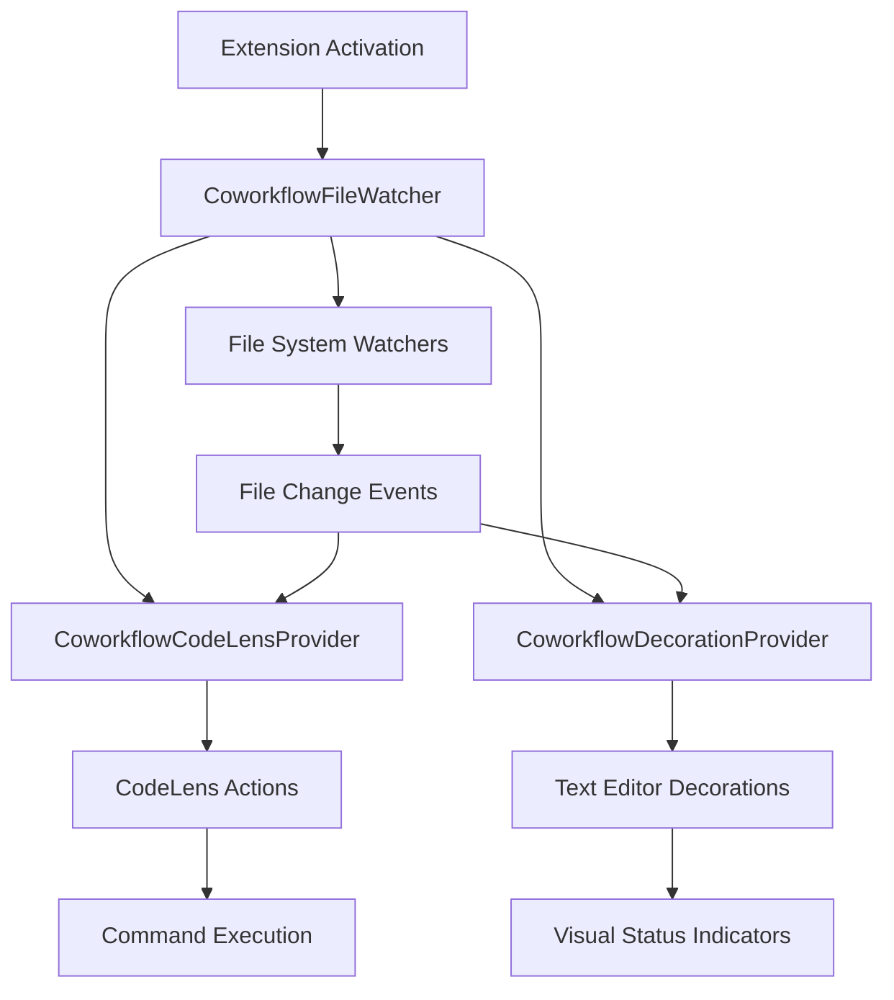

# 前置依赖文件： [requirements.md](./requirements.md)

# Design Document

## Overview

This feature implements comprehensive support for .coworkflow directory Markdown files by adding file monitoring, CodeLens operations, and visual decorations. The implementation follows VS Code extension patterns and integrates with the existing extension architecture.

## Architecture

The feature consists of three main components:

1. **CoworkflowFileWatcher**: Monitors .coworkflow directory files and coordinates updates
2. **CoworkflowCodeLensProvider**: Provides contextual actions via CodeLens for different document types
3. **CoworkflowDecorationProvider**: Manages visual decorations for task status indicators

### Component Interaction Flow



## Components and Interfaces

### 1. CoworkflowFileWatcher

**Purpose**: Central coordinator for file monitoring and provider management

**Key Responsibilities**:

- Monitor .coworkflow directory for requirements.md, design.md, tasks.md
- Coordinate updates between CodeLens and decoration providers
- Handle workspace changes and re-establish watchers

**Interface**:

```typescript
interface CoworkflowFileWatcher {
	initialize(): void
	dispose(): void
	onFileChanged(uri: vscode.Uri): void
	getCoworkflowPath(): string | undefined
}
```

### 2. CoworkflowCodeLensProvider

**Purpose**: Provide contextual actions for different document types

**Key Responsibilities**:

- Parse document structure to identify action locations
- Provide document-specific actions (Update, Run, Retry)
- Handle CodeLens command execution

**Interface**:

```typescript
interface CoworkflowCodeLensProvider extends vscode.CodeLensProvider {
	provideCodeLenses(document: vscode.TextDocument): vscode.CodeLens[]
	resolveCodeLens(codeLens: vscode.CodeLens): vscode.CodeLens
}
```

**Document-Specific Actions**:

- **requirements.md**: "Update" actions at requirement section headers
- **design.md**: "Update" actions at major section headers
- **tasks.md**: "Run" and "Retry" actions at individual task items

### 3. CoworkflowDecorationProvider

**Purpose**: Manage visual status indicators for tasks

**Key Responsibilities**:

- Parse task status indicators: `[ ]`, `[-]`, `[x]`
- Apply appropriate background decorations
- Update decorations when task status changes

**Interface**:

```typescript
interface CoworkflowDecorationProvider {
	updateDecorations(document: vscode.TextDocument): void
	dispose(): void
}
```

**Decoration Types**:

- `[ ]` (未开始): No background decoration
- `[-]` (进行中): Light yellow background (`rgba(255, 255, 0, 0.2)`)
- `[x]` (已完成): Light green background (`rgba(0, 255, 0, 0.2)`)

## Data Models

### Task Status Model

```typescript
interface TaskStatus {
	line: number
	range: vscode.Range
	status: "not_started" | "in_progress" | "completed"
	text: string
}
```

### CodeLens Action Model

```typescript
interface CoworkflowCodeLens extends vscode.CodeLens {
	documentType: "requirements" | "design" | "tasks"
	actionType: "update" | "run" | "retry"
	context?: {
		taskId?: string
		sectionTitle?: string
	}
}
```

### File Context Model

```typescript
interface CoworkflowFileContext {
	uri: vscode.Uri
	type: "requirements" | "design" | "tasks"
	lastModified: Date
	isActive: boolean
}
```

## Error Handling

### File System Errors

- **Missing .coworkflow directory**: Gracefully disable watchers without errors
- **Missing target files**: Handle file absence without crashing providers
- **File permission errors**: Log warnings and continue with available functionality

### Parsing Errors

- **Malformed Markdown**: Provide basic functionality, skip problematic sections
- **Invalid task status**: Default to 'not_started' status for unknown formats
- **Corrupted file content**: Use fallback parsing with error logging

### Provider Errors

- **CodeLens resolution failures**: Return empty CodeLens array
- **Decoration application failures**: Log errors and continue
- **Command execution errors**: Show user-friendly error messages

## Testing Strategy

### Unit Tests

- **CoworkflowFileWatcher**: Test file monitoring, workspace changes, disposal
- **CoworkflowCodeLensProvider**: Test document parsing, CodeLens generation, command resolution
- **CoworkflowDecorationProvider**: Test task status parsing, decoration application

### Integration Tests

- **File System Integration**: Test actual file watching with temporary files
- **VS Code API Integration**: Test CodeLens and decoration providers with mock documents
- **Command Integration**: Test command execution and error handling

### Edge Case Tests

- **Empty files**: Ensure providers handle empty documents
- **Large files**: Test performance with documents containing many tasks
- **Concurrent changes**: Test behavior when multiple files change simultaneously
- **Workspace switching**: Test proper cleanup and re-initialization

## Implementation Phases

### Phase 1: Core Infrastructure

- Implement CoworkflowFileWatcher with basic file monitoring
- Set up provider registration and disposal patterns
- Create basic command structure

### Phase 2: CodeLens Implementation

- Implement CoworkflowCodeLensProvider with document parsing
- Add document-specific action detection
- Implement command handlers for Update, Run, Retry actions

### Phase 3: Decoration Implementation

- Implement CoworkflowDecorationProvider with task status parsing
- Create decoration types for different task statuses
- Add real-time decoration updates

### Phase 4: Integration and Polish

- Integrate all components with extension activation
- Add comprehensive error handling
- Implement performance optimizations
- Add configuration options if needed
