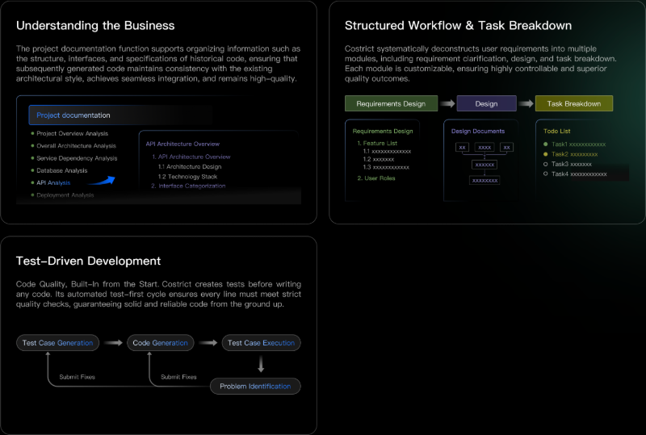
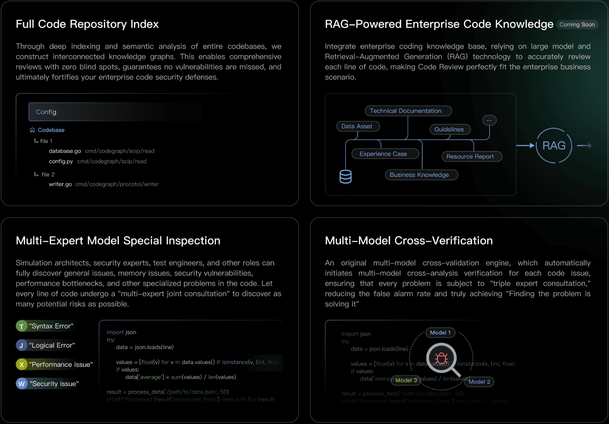
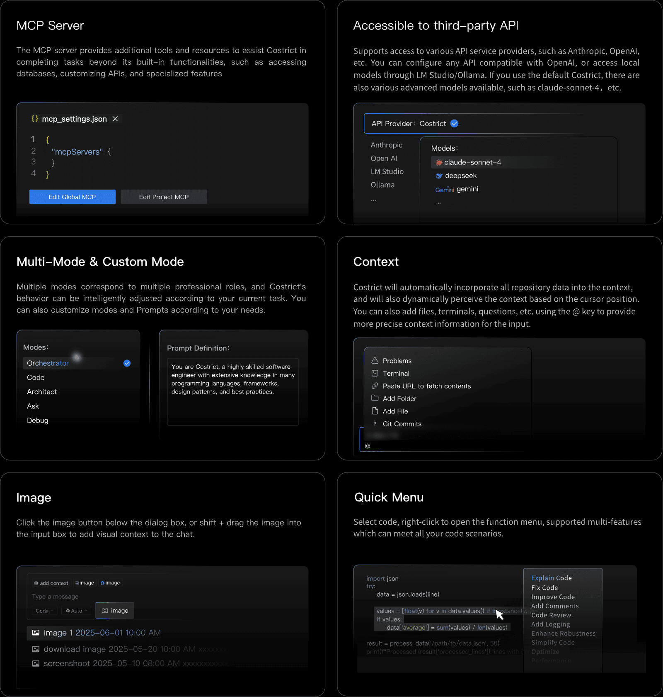

    <h1>CoStrict  (prev. Shenma)</h1>
    <h2>Strict AI coder for enterprises</h2>

 

English | <a href="https://github.com/zgsm-ai/costrict/blob/main/README.zh-CN.md" target="_blank">简体中文</a>

 
 

Costrict is a **free, open-source AI-assisted programming tool** that supports private deployment for enterprises, making it the optimal choice for enterprise serious programming. Its core capabilities are outstanding: **Strict Mode，Code Review** , Code Completion, etc. Feature highlights include: enterprise-level business understanding, standardized AI development processes, Vibe Mode, MCP service, multiple advanced free models, API/model customization, mode selection/customization, image context capabilities, and more. It supports multiple mainstream IDEs and leads the way in supporting VS Code and JetBrains IDEs. Compatible with popular languages including Python, Go, Java, JavaScript/ TypeScript, and C/C++."

## Features

- **Strcit Mode:**

Strict Mode standardizes the process of AI-generated code, making it more aligned with enterprise development scenarios. It systematically breaks down a single requirement into steps such as：Requirements Analysis, Architecture Design, Task Planning and Test Generation etc. acting as a standardized procedure for AI to ensure high-quality and highly controllable output.

- **Code Review:**

Code Review enables indexing and parsing of entire code repositories, implementing company-wide RAG (Retrieval-Augmented Generation) for coding knowledge.
It adopts the strategy of "specialized checks by a multi-expert model" + "cross-confirmation by multiple models."
It supports users in conducting code checks on functions, selected code lines, code files, and entire project files.

 

- **More features:**

    - **Code Completion:** Automatically generates subsequent code based on the cursor's context code, quickly outputs code in seconds
    - **Vibe Code:** Vibe Code is designed for rapid development and simple tasks. It supports multi-turn natural language dialogue, allowing for real-time refinement and precise code generation.
    - **MCP Service:** Seamlessly integrates with the MCP open ecosystem to enable standardized system connectivity. You can Integrate external APIs、Connect to databases、Develop custom tools through MCP services.
    - **APIs & Model Customization:** Officially provided are multiple free advanced models like claude-sonnet-4; it also supports using third-party API providers such as Anthropic, OpenAI, etc.; you can also configure any API compatible with OpenAl; or use local models through I M Studio/Ollama
    - **Mode Customization:** We provide various default modes to adapt to different scenarios, such as the Code mode with outstanding coding capabilities and the Orchestrator mode skilled in complex task decomposition. You can also customize mode according to your needs.
    - **Context:** Shenma will automatically incorporate all repository data of large files into the context, and for code completion scenarios, it will also dynamically perceive the context based on the cursor position. You can also add files/folders, terminals, issues, etc. using the @ key to provide more precise context information for the input.
    - **Image:** You can click the image icon below the dialog box to upload an image, or you can hold down the Shift key to drag and drop the image into the input box.
    - **Multi-language Support:** Supports mainstream programming languages: Python, Go, Java, JavaScript, TypeScript, C/C++ and all other programming languages
    - **Privacy & Security:** To ensure data security and provide better service at a lower cost, we offer a professional and comprehensive private deployment solution, ensuring code security through physical isolation and end-to-end encryption.

    

 

## For more assistance

Refer to [Deployment Guide](https://docs.costrict.ai/en/guide/installation)

Guidelines for private deployment: https://docs.costrict.ai/en/deployment/introduction

## Contributing

We welcome contributions! Please review [How To Contribute](assets/docs/devel/en-US/how-to-contribute.md) for guidelines.

## Community

Communicate via [GitHub Issues](https://github.com/zgsm-ai/costrict/issues/new/choose) or pull requests.

## License

[Apache 2.0 © 2025 CoStrict, Inc.](./LICENSE)

## Star History

