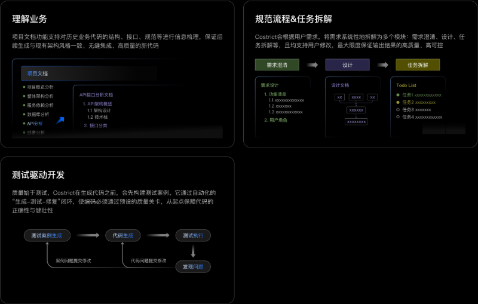
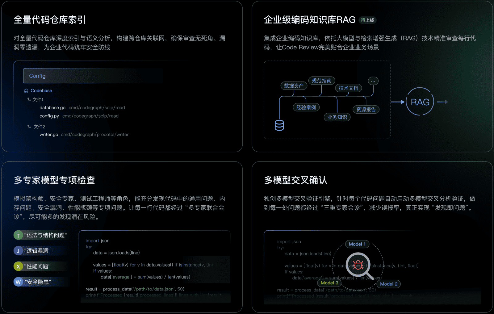
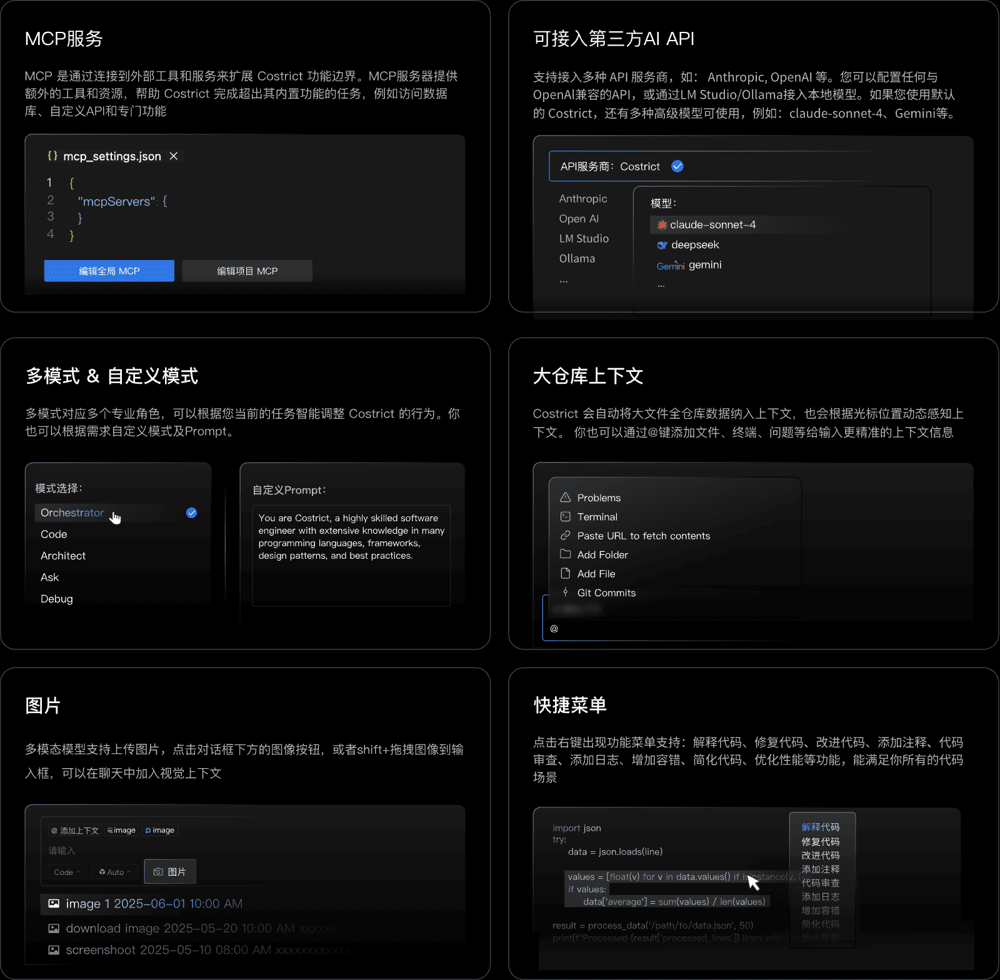

    <h1>CoStrict (prev. Shenma)</h1>
    <h2>企业严肃开发的AI智能体伙伴</h2>

 

<a href="https://github.com/zgsm-ai/costrict/blob/main/README.md" target="_blank">English</a> | 简体中文

 
 

CoStrict 是一款免费开源的AI辅助编程工具，支持企业私有化部署，是企业严肃编程的最佳选择。核心场景能力突出：企业级严肃编程（Strict Mode）、代码审查（Code Review）、代码补全（Code Completion）等，特性功能亮点十足：企业级业务理解、系统规范的AI开发流程、氛围编程模式、MCP服务、多种高级免费模型、API/模型自定义、模式选择/自定义等。支持多种主流IDE工具，已支持VS Code和JetBrains IDEs。支持Python、Go、 Java、JavaScript/TypeScript、C/C++等多种主流语言。

## 产品特性 Features

- **严肃编程（Strcit Mode）：**
  严肃编程规范了AI生成代码的流程，使其更符合企业开发场景。它将一句话的需求，系统性地拆解为需求设计、架构设计、测试设计、代码设计等步骤，如同为AI设定了标准工序，确保输出结果高质量、高可控。

 

- **代码补全（Code Completion）：**
  代码审查能够进行全量代码仓库的索引解析，公司级编码知识库RAG（增强检索） 在发现问题和确认问题上采用“多专家模型专项检查”+“多模型交叉确认”策略 支持用户对函数、选中代码行、代码文件和整个工程文件进行代码检查

 

- **更多特性（More Features）：**
    - **代码补全：** 代码自动补全，Costrcit能根据光标所在位置的上下文代码，自动生成后续代码，快速秒级出码
    - **氛围编程：** 氛围编程专为快速开发与简单任务场景设计，它支持多轮自然语言对话，边说边改，精准生成代码
    - **MCP服务：** 无缝对接MCP开放生态，实现标准化系统连接。您可以通过MCP服务集成外部 API、连接数据库或开发定制工具等
    - **第三方API和模型自定义：** 官方提供了各种免费的高级模型，像claude-sonnet-4；也支持使用第三方API提供商如Anthropic、OpenAl等；您还可以配置任何与OpenAl兼容的API；或者通过I M Studio/Ollama使用本地模型
    - **模式自定义：** 我们提供了多种默认模式以适应不同场景，例如：代码能力突出的Code模式、擅长复杂任务拆解的Orchestrator模式。您也可以根据需求自定义模式
    - **大仓库上下文：** Costrict 会自动将大文件全仓库数据纳入上下文，对于代码补全场景也会根据光标位置动态感知上下文。 你也可以通过@键添加文件/文件夹、终端、问题等等给输入更精准的上下文信息
    - **支持图片：** 多模态模型支持上传图片，您可以点击对话框下方的图片icon上传图片，也可以按住shift键将图片拖拽到输入框内
    - **快捷菜单：** 选中代码，点击右键出现功能菜单，支持：解释代码、修复代码、改进代码、添加注释、代码审查、添加日志、增加容错、简化代码、优化性能等功能，能满足你所有的代码场景
    - **多语言支持：** 支持主流编程语言：Python, Go, Java, JavaScript, TypeScript, C/C++ 等所有编程语言
    - **隐私 & 安全：** 为确保数据安全和更好的服务更低的成本，我们提供了专业完整的私有化部署方案，通过物理隔离和端到端加密，确保代码的安全。

## 更多帮助 For more assistance

更多操作详情可访问 CoStrict 官方文档：https://docs.costrict.ai/guide/installation

私有化部署指引文档：https://docs.costrict.ai/deployment/introduction

## 如何贡献

CoStrict 是由友好的用户、贡献者、提交者和项目管理委员会成员共同开发和维护的开源项目。

欢迎所有人以多种方式加入并为项目做出贡献，不仅限于代码贡献。诸如上报问题、报告漏洞、提议新功能、改进文档、完善网站、组织活动或撰写博客文章等贡献均受到欢迎和认可。

本文档是 CoStrict 社区新成员入门贡献项目的指南。

### 上报问题

首先确保该问题尚未报告，您可以在 GitHub 的 [Issues](https://github.com/zgsm-ai/costrict/issues) 下进行搜索。

如果您无法找到一个开放的问题来解决该问题，可以 [新建 Issue](https://github.com/zgsm-ai/costrict/issues/new/choose)。请确保包含一个标题和清晰的描述，尽可能多的相关信息，以及一个代码示例或可执行的测试用例，以方便其他维护者复现该问题。

### 提交代码

CoStrict项目采用 Github Forking 工作流：[CoStrict项目代码贡献流程](https://github.com/zgsm-ai/costrict/blob/main/assets/docs/devel/zh-CN/fork.md)

## 版权声明

[Apache 2.0 © 2025 CoStrict, Inc.](./LICENSE)

## Star History

